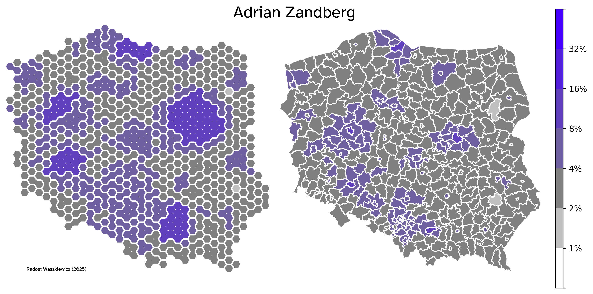

# Hexagons for Polish voting data

This repository contains a few scripts used to generate powiat-hexagon mapping. It can be used to better spatially represent data regarding population. After all, it's the people that vote not the land.

Copyright Radost Waszkiewicz (2025)

